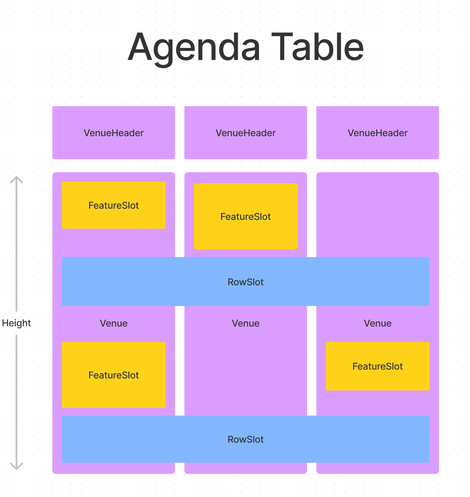

# Building Agendas

This folder structure contains the building blocks needed to create agendas.
Agendas consist of the following main elements:

- `Program` - A object structure containing `Features` (e.g meetings or talks)
  and `Rows` (e.g common lunch breaks).
- `AgendaTable` - Component that takes a `Program`, and creates `Slots` for each
  `Feature` and `Row` that are sized and positioned according to their `from`
  and `to` times: `Rows` span the entire width of the agenda, while `Features`
  are placed in colums called `Venues`.
- `Render functions` - Functions that describe how each `Feature`, `Row` or
  `VenueHeader` should be rendered within the `Slots` by the `AgendaTable`.

## The Agenda Table

The `AgendaTable` is the core of the agenta. It is responsible positioning and
sizin it's content in `Slots`:

The `height` og an `AgendaTable` is _not dynamic_, but has to be given
explicitly. This is because all the `Slots` are absolute positioned with
relative (percentile) sizing. This means that setting the `height` controls the
height of each `Slot`.
